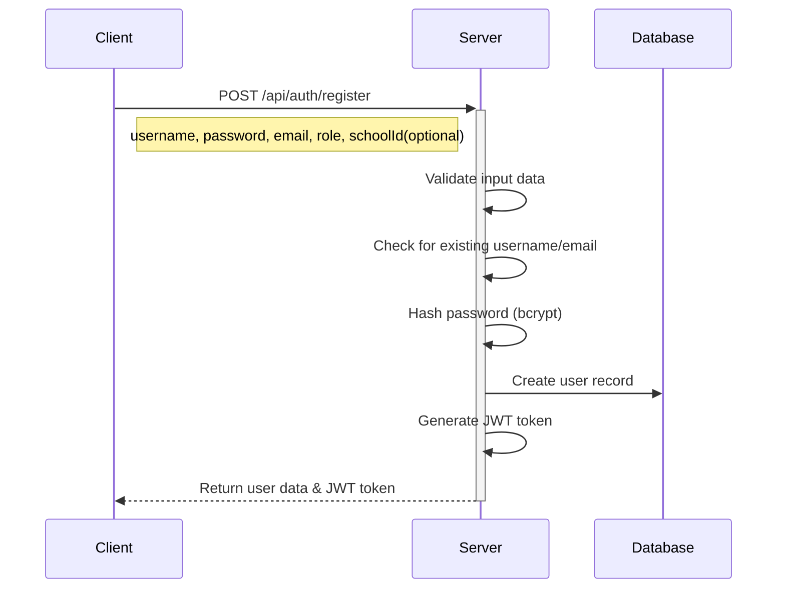
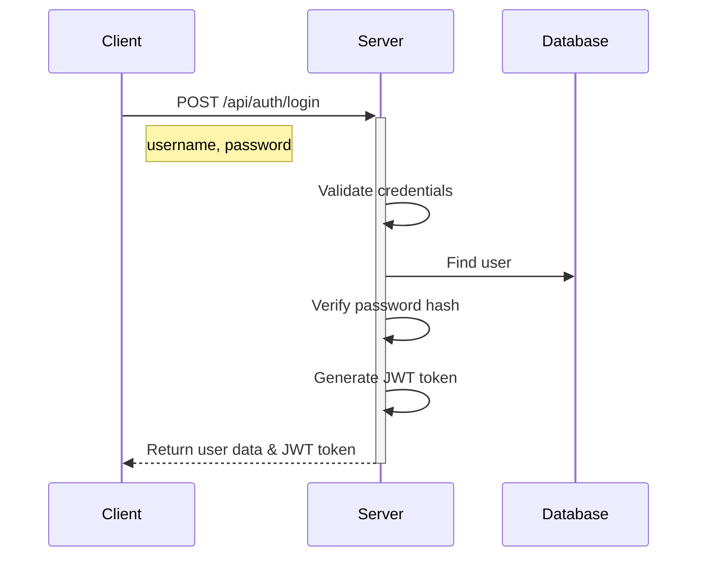
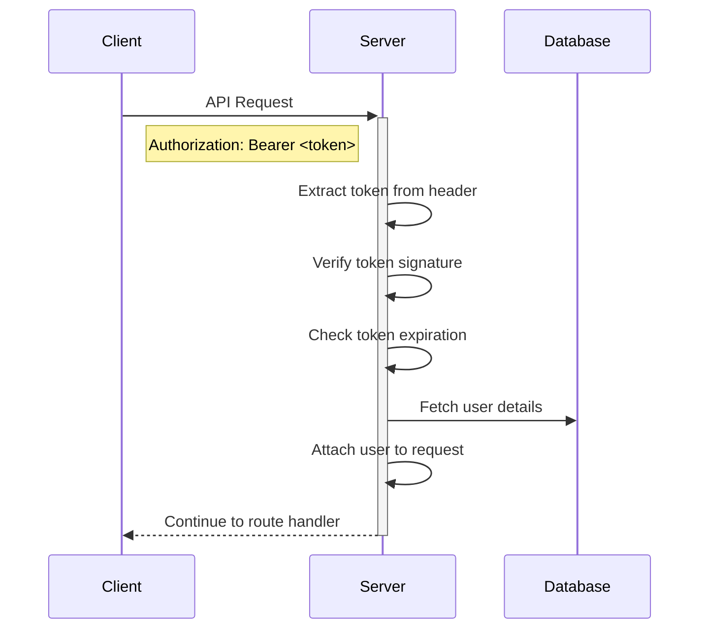

# Authentication Flow Documentation

## Overview
The School Management System implements a secure JWT-based authentication system with role-based access control (RBAC). This document outlines the authentication mechanisms, token handling, and security measures implemented in the system.

## User Roles

### Superadmin
- Full system access
- Can manage all schools, classrooms, and students
- Can create school administrators
- Not associated with any specific school
- Use role: `superadmin` during registration

### School Administrator
- Limited to managing their assigned school
- Can manage classrooms and students within their school
- Cannot access other schools' resources
- Must be associated with a specific school during registration
- Use role: `schoolAdmin` during registration

## Authentication Process

### 1. Registration Flow


#### Key Points:
- Password is hashed using bcrypt with salt factor 10
- SchoolId is required only for school administrators
- Email and username must be unique
- Returns long-lived JWT token on success

### 2. Login Flow


### 3. Token Structure

#### JWT Token Payload
```json
{
    "userId": "<user_id>",
    "userKey": "<username>",
    "exp": "<expiration_timestamp>"
}
```

#### Token Characteristics:
- Long-lived tokens (3 years validity)
- Signed using HS256 algorithm
- Contains minimal payload for security
- No sensitive data stored in token

### 4. Authentication Middleware Flow


## Security Measures

### Rate Limiting
- 10 requests per minute per IP address
- Applies to all authenticated endpoints
- Returns 429 Too Many Requests when limit exceeded
- Includes rate limit headers in response:
  - X-RateLimit-Limit
  - X-RateLimit-Remaining
  - X-RateLimit-Reset

### Additional Security Headers
- Helmet middleware enabled
- Content Security Policy headers
- HTTPS enabled in production

### Error Handling

#### Authentication Errors
```json
{
    "ok": false,
    "code": 401,
    "message": "Error message",
    "errors": []
}
```

Common error scenarios:
- Missing token: 401 "Authorization header with Bearer token required"
- Invalid token: 401 "Invalid token"
- Expired token: 401 "Token expired"
- User not found: 401 "User not found"

#### Authorization Errors
```json
{
    "ok": false,
    "code": 403,
    "message": "Error message",
    "errors": []
}
```

Common error scenarios:
- Insufficient permissions: 403 "Unauthorized - Insufficient permissions"
- Cross-school access attempt: 403 "Unauthorized - Can only access resources from your own school"

## Implementation Guidelines

### Making Authenticated Requests
1. Obtain JWT token through login or registration
2. Include token in Authorization header:
```
Authorization: Bearer <token>
```

### Protected Routes
- All routes except `/auth/login` and `/auth/register` require authentication
- Authentication middleware validates token before processing request
- Authorization middleware checks user permissions based on role

## Testing Authentication
The system includes comprehensive test cases for authentication flows:
Refer to `__tests__/managers/auth/Auth.test.js` for test implementations.
